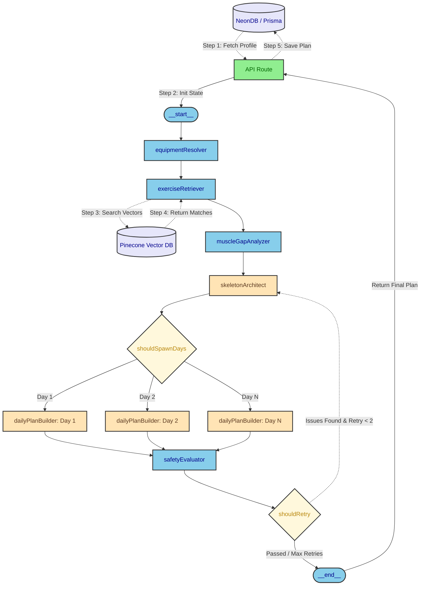

# FitSpark

FitSpark is a workout planner built on Next.js. It uses a multi-agent LangGraph workflow and Retrieval-Augmented Generation (RAG) to dynamically generate personalized workout routines. 

For the exercise dataset, a custom ingestion pipeline normalizes over 800+ raw exercises from [yuhonas/free-exercise-db](https://github.com/yuhonas/free-exercise-db). The pipeline compresses the exercise images and stores them in Google Cloud Storage, saves the relational equipment data in NeonDB, and vectorizes the exercises into Pinecone. This ensures the planner only assigns biomechanically accurate exercises that strictly match the equipment you have available at home or in your gym.

The app acts as an autonomous multi-agent fitness coach. It provides an interactive UI allowing users to log sets, track progress, and build historical memory, which the agentic LLM uses to progressively overload future workouts. 

Everything is designed for scalability and cost-efficiency. The infrastructure is modeled in Terraform and automatically deployed as containerized Cloud Run services to operate entirely within the free tier of Google Cloud Platform (GCP) via Cloud Build.

## 2. Architecture



### Core Infrastructure & Engineering Impact

To orchestrate dynamic workout generation and ensure safety constraints without dropping requests, the system utilizes a compiled stateful pipeline. Every technology chosen serves a highly specific engineering purpose:

* **Next.js & React**: Powers the interactive UI with TailwindCSS and shadcn/ui. The serverless API routes act as the secure entry point, triggering the LangGraph workflow while keeping all LLM prompts and Pinecone/NeonDB credentials strictly isolated from the client.
* **LangGraph**: Orchestrates the multi-agent AI architecture. It routes data through specialized agent nodes instead of relying on a single unpredictable prompt. The pipeline queries NeonDB to inject the user's historical workout data, allowing the `skeletonArchitect` agent to analyze past progress alongside available equipment to build the weekly framework. Finally, the `dailyPlanBuilder` agent executes a parallel Map-Reduce fan-out to generate specific sets and reps for each day.
* **Google AI Studio & Gemini LLM Cascade**: Provides the underlying LLM intelligence for the LangGraph agents. To ensure zero downtime and high availability, it utilizes a custom fallback cascade through Google AI Studio. Primary inference calls route to Gemini 3.6 Flash, automatically falling back to Gemini 3.5 Flash, and finally Gemini 3.0 if rate limits are encountered.
* **Zod Schema Validation**: Enforces strict end-to-end type safety across the stack. Zod validates the runtime secrets injected from GCP, sanitizes frontend form inputs, and most importantly, forces the LangGraph agent's unstructured text generation into a deterministic, strictly typed JSON schema (`weeklyWorkoutPlanSchema`) before the final workout plan is allowed to be written to the database.
* **Data Ingestion Pipeline**: A Node.js pipeline that pulls 800+ raw exercises from the [yuhonas/free-exercise-db](https://github.com/yuhonas/free-exercise-db) dataset. It normalizes the JSON data, seeds the relational equipment classifications into NeonDB, and prepares the assets for cloud storage and vectorization.
* **Google Cloud Storage (GCS) & Image Compression**: During ingestion, exercise image assets are processed using the Node.js `sharp` library to achieve a 40% reduction in file size. These optimized assets are uploaded to GCS, and their resulting public URLs are seeded directly into NeonDB. This allows the frontend to rapidly fetch the optimized images without straining the main application servers.
* **Pinecone Vector DB & Strict RAG Enforcement**: Handles semantic search. To guarantee accuracy, the LangGraph retrieval node performs a secondary strict-equality JavaScript filter over the vector search results to ensure the returned exercise metadata perfectly matches the user's available equipment. The LLM is strictly restricted to this RAG pool. If Gemini hallucinates an exercise from its internal training knowledge, the deterministic `safetyEvaluator` node detects the RAG violation and forces a LangGraph regeneration loop, completely blocking non-RAG data from reaching the database.
* **NeonDB & Prisma**: The serverless PostgreSQL database stores the core application data: user authentication metadata, Stripe subscription statuses, selected gym equipment profiles, and historical workout tracking. The API route queries these tables pre-graph to inject past workout sessions into the context, and writes back the final validated `WorkoutPlan` post-graph.
* **Programmatic Safety Evaluator**: A deterministic TypeScript validation node (`safetyEvaluator`) that acts as a strict firewall. It catches LLM hallucinations (e.g., assigning squats when the user has bad knees) and forces a loop back to the architect, blocking dangerous workouts before they ever reach the database.
* **Serverless Compute (Google Cloud Run)**: Deployed the Next.js application to Cloud Run to achieve zero-downtime auto-scaling. This ensures the app seamlessly handles massive traffic spikes during complex workout generations without paying for idle servers.
* **Asset Delivery (Google Cloud Storage)**: Used GCS to store the compressed exercise image assets. This drastically reduces bandwidth load on the main application servers by offloading static file delivery to a high-speed global network.
* **Zero-Trust Security (GCP Secret Manager)**: Protected sensitive LLM API keys and database credentials by isolating them in Secret Manager, ensuring zero secrets are ever exposed in the source code or local environment files.
* **Infrastructure as Code (Terraform)**: Eliminated manual server configuration by defining the entire cloud architecture in Terraform, ensuring the infrastructure is instantly reproducible and version-controlled.
* **Deployment Automation (Cloud Build)**: Engineered an automated pipeline that builds the Docker containers, securely injects runtime secrets, and deploys new images directly to Cloud Run without human intervention.
* **Clerk & Stripe**: Clerk provides robust, secure JWT-based user authentication, while Stripe manages subscription tiers and billing infrastructure directly through Next.js API webhooks.

## 3. Installation & Setup

### Environment Variables & Secret Manager
Because this application is deployed securely to Cloud Run, all sensitive credentials must be packed into a single JSON object and stored in Google Cloud Secret Manager under the secret name `fitspark-runtime-config`. 

This JSON object must contain the following keys:
```json
{
  "DATABASE_URL": "postgresql://...",
  "GEMINI_API_KEY": "...",
  "GEMINI_MODEL": "gemini-3.6-flash",
  "CLERK_SECRET_KEY": "sk_...",
  "NEXT_PUBLIC_CLERK_PUBLISHABLE_KEY": "pk_...",
  "CLERK_ENCRYPTION_KEY": "...",
  "STRIPE_SECRET_KEY": "sk_...",
  "STRIPE_WEBHOOK_SECRET": "whsec_...",
  "NEXT_PUBLIC_STRIPE_PUBLISHABLE_KEY": "pk_...",
  "STRIPE_PRICE_WEEKLY": "...",
  "STRIPE_PRICE_MONTHLY": "...",
  "STRIPE_PRICE_YEARLY": "...",
  "NEXT_PUBLIC_BASE_URL": "...",
  "PINECONE_API_KEY": "...",
  "PINECONE_INDEX_NAME": "...",
  "PINECONE_INDEX_HOST": "https://...",
  "PINECONE_NAMESPACE": "...",
  "RAG_IMAGE_BUCKET": "..."
}
```
For local development, you can assign this entire minified JSON string to the `FITSPARK_RUNTIME_CONFIG_JSON` variable in your `.env.local` file.

### Infrastructure Deployment (Terraform & GCP)
The backend infrastructure is defined using Terraform. Before deploying, bootstrap your Google Cloud project and ensure your Artifact Registry is provisioned so Cloud Build can securely access your containers.

1. **Configure Artifact Registry**:
```bash
gcloud artifacts repositories create fit-spark \
  --repository-format=docker \
  --location=us-central1
```

2. **Deploy Compute Workloads**:
The repository includes deployment scripts that package the source and submit to Cloud Build.
```powershell
.\infra\app\deploy.ps1
.\infra\ingestion\deploy.ps1
```

3. **Secret Management**:
Ensure the `fitspark-runtime-config` secret exists in GCP Secret Manager. Cloud Build automatically injects this during the Docker build process.

### Local Development Setup
After infrastructure is deployed (or for local testing), generate your environment variables and initialize the server.

1. **Configure Environment Variables**:
Copy `.env.local.example` to `.env.local` and populate the required API keys (Gemini, Pinecone, NeonDB, Clerk).

2. **Initialize Database**:
```bash
npm install
npm run prisma:generate
npx prisma db push
```

3. **Start the Development Server**:
```bash
npm run dev
```
Once started, navigate to `http://localhost:3000` to interact with the FitSpark UI.

## 4. Testing & Quality Assurance

> [!TIP]
> **Stripe Billing is currently configured in Test Mode.** 
> To test the subscription and checkout flows locally, use the standard Stripe test debit card:
> - **Card Number**: `4242 4242 4242 4242`
> - **Expiration**: Any future date (e.g., `12/30`)
> - **CVC**: Any 3 digits (e.g., `123`)

FitSpark maintains high reliability through a multi-layered testing strategy that covers UI interactions, component logic, and LLM output consistency.

### 4. Running the Complete Test Suite

A single unified script executes the entire testing suite locally before deployment:
```bash
npm run test:all
```
This single command sequentially triggers:
1. **Unit Testing (Jest)**: Executes `npm run test` to validate core utility functions, React components, and deterministic LangGraph node logic (e.g., `equipmentResolver`).
2. **End-to-End Testing (Playwright)**: Executes `npm run test:e2e` to spin up a headless browser and simulate actual user flows—from logging in via Clerk to selecting equipment and generating a workout. You can also run this interactively with the Playwright UI using `npm run test:e2e:ui`.
3. **LLM Evaluation (LangSmith)**: Executes `npm run eval` to run programmatic evaluations on the Gemini LLM outputs, ensuring the generated workout routines consistently meet safety and formatting constraints over time.

## 5. Key Technical Achievements
* **Stateful Workout Memory**: Engineered a historical context pipeline that analyzes a user's previously completed exercises and session logs to dynamically adjust progressive overload and prevent repetitive routines.
* **Dynamic Equipment Resolution**: Integrated semantic RAG via Pinecone to filter over 800 exercises in real-time, ensuring generated workouts strictly match the user's specifically selected home or gym equipment without relying on unreliable LLM guesswork.
* **Interactive Session Tracking**: Built an in-app tracking system allowing users to mark sets as done and log performance, which feeds directly back into the NeonDB state to create a continuous feedback loop for future LLM generations.
* **Parallel Workout Generation**: Implemented a LangGraph Map-Reduce fan-out pipeline that dynamically spawns concurrent worker nodes based on user input, drastically reducing the latency of multi-day workout generation.
* **Programmatic Safety Firewalls**: Developed a strict TypeScript validation node (`safetyEvaluator`) that programmatically intercepts and forces retries on unsafe LLM outputs before they can be persisted to the database.
* **End-to-End Type Safety**: Leveraged Zod to force the LLM's unstructured text generation into a deterministic JSON schema, completely eliminating runtime parsing errors.
* **High-Availability LLM Cascade**: Built a custom fallback routing mechanism through Google AI Studio that automatically shifts traffic from Gemini 3.6 Flash to 3.5 and 3.0 during rate limits, ensuring zero downtime.
* **Optimized Data Ingestion**: Engineered a custom one-click Node.js pipeline that simultaneously synchronizes relational data into PostgreSQL, vectorizes embeddings into Pinecone, and achieves a 40% file size reduction on exercise images via `sharp` before serving them securely through Google Cloud Storage.
* **Automated GCP Builds**: Configured Terraform for Google Cloud Platform (GCP) resources, using Cloud Build to automate containerized deployments to Cloud Run.
* **Continuous AI Evaluation (LangSmith)**: Engineered a suite of LangSmith evaluations to programmatically score the RAG pipeline. By using a strict regex evaluator for Pinecone equipment compliance and LLM-as-a-judge evaluators for hallucinations and persona checks, this continuous testing loop directly exposed prompt weaknesses, allowing the agents to be iteratively refined to become highly accurate and significantly more efficient in token consumption.
* **Deterministic E2E Testing (Playwright)**: Engineered a comprehensive headless Playwright testing suite that automatically simulates complex, real-world user flows (e.g., Stripe checkouts, Auth, equipment selection) to guarantee UI reliability before any Cloud Run deployment.